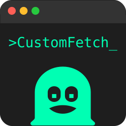
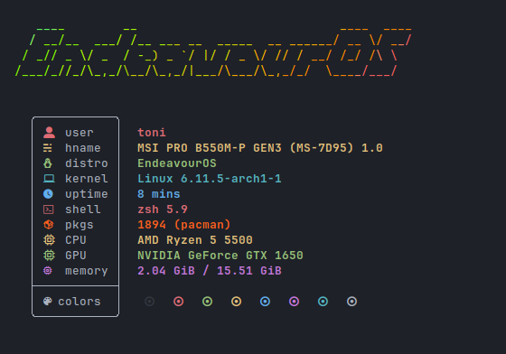
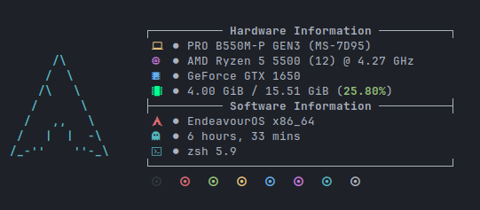
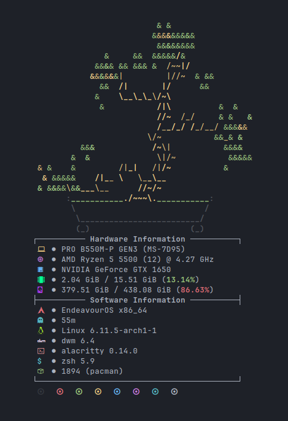
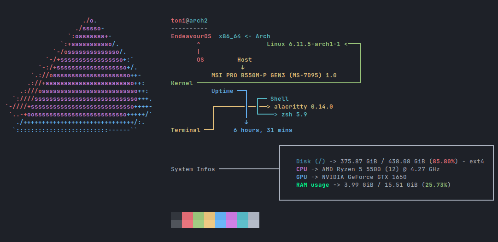
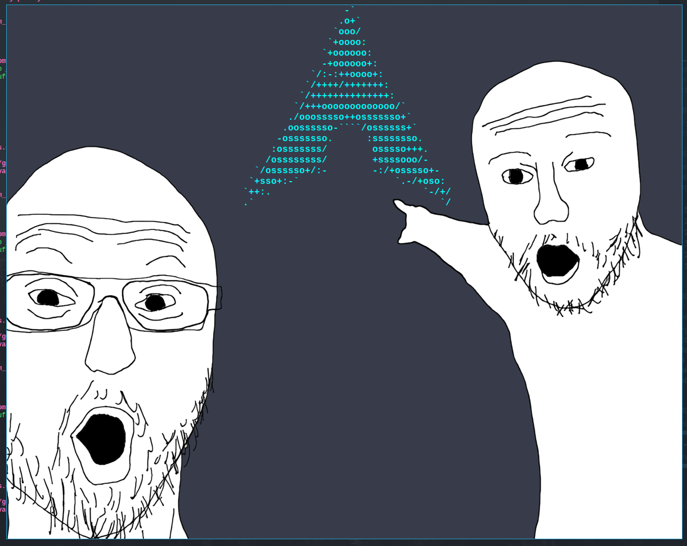

<p align="center">
  
</p>

<h2></h2> <!-- add a separating line -->

> [!WARNING]
> Parts of this README refers to the `v2.0.0-beta1` release.  
> Some features such as the plugin system may differ from the upcoming stable release.

<p align="center">
    A modular information fetching (neofetch-like) tool, which its focus point is the performance and <b>customizability</b>
</p>

<p align="center">
    
    
    
</p>

<!--Currently supports Linux distros only. Android may be coming when stable release
<!-- Comment this because it's still in WIP for 3 weeks, no shit it won't work on some OSs
>[!NOTE]
>The goal is to be cross-platform, so maybe Android and MacOS support will come some day\
>but if you're using a UNIX OS, such as FreeBSD or MINIX, or those "obscure" OSs\
>then some, if not most, query infos won't probably work.\
>So you may want to relay to shell commands for quering\
>or maybe continue using neofetch/fastfetch if it still works great for you
-->

<!-- Looks fire on PC but ass on mobile fucking hell. too bad -->



<p align="center">
    
</p>


<!-- Leaving this here for future, it's not as fire as the one above
| | |
|:-:|:-:|
|  |  |
|  |  |
-->

## Key Features
- Works as a **terminal program**, **GTK3 GUI app**, or **native Android widget**
- Modular design - fetch anything through `$<>` tags and plugins
- Super lightweight
- Easy to configure and script
- Optional dependencies only, no runtime bloat (as like as [fastfetch](https://github.com/fastfetch-cli/fastfetch)
- Plugin system for adding new info sources

## Dependencies
Customfetch has no required dependencies unless you build the GUI app version.\
For compiling from source, all you need is a **C++20** compiler (C++17 might still work).

Packages for running the GUI app:
* `gtk3`
* `gtkmm3`

Optional packages that will make customfetch system query faster:
* `dconf`: Alternative to the slow `gsettings` command
* `libxfce4util`: Query XFCE4 version faster
* `wayland-client`: Library for getting the Wayland compositor faster

## Installation

### Debian / Ubuntu
Grab the latest `.deb` file from the [releases page](https://github.com/Toni500github/customfetch/releases/latest).

### Arch (AUR)
```bash
# Binary versions
yay -S customfetch-bin          # Terminal only
yay -S customfetch-gui-bin      # GUI version

# Source versions
yay -S customfetch              # Terminal only
yay -S customfetch-gui          # GUI version

# Unstable / git versions
yay -S customfetch-git
yay -S customfetch-gui-git
```

### Manual installation (for other distros)
Download the `.tar.gz` from [releases](https://github.com/Toni500github/customfetch/releases/latest).  
It includes a `/usr` folder so you can install it manually or through your package manager.

### Android widget
Moved to its own repo:  
https://github.com/Toni500github/customfetch-android-app

### Build from source
```bash
git clone --depth=1 https://github.com/Toni500github/customfetch
cd customfetch

# DEBUG=0 for release build
# GUI_APP=0 or 1 for terminal or GUI app
make install DEBUG=0 GUI_APP=0

customfetch
```

## How to customize
This is only an explanation about tags and preview, that can be always found in the documentation.

Here's an example using my config

```toml
[config]

# The array for displaying the system/fetched infos
layout = [
    "$<title>",
    "$<title.sep>",
    "${auto}OS: $<os.name> $<system.arch>",
    "${auto}Host: $<system.host>",
    "${auto}Kernel: $<os.kernel>",
    "${auto}Uptime: $<os.uptime>",
    "${auto}Terminal: $<user.terminal>",
    "${auto}Shell: $<user.shell>",
    "${auto}Packages: $<os.pkgs>",
    "${auto}Theme: $<theme.gtk.all.name>",
    "${auto}Icons: $<theme.gtk.all.icons>",
    "${auto}Font: $<theme.gtk.all.font>",
    "${auto}Cursor: $<theme.cursor>",
    "${auto}WM: $<user.wm.name> $<user.wm.version>",
    "${auto}DE: $<user.de.name> $<user.de.version>",
    "$<auto.disk>",
    "${auto}Swap: $<swap>",
    "${auto}CPU: $<cpu>",
    "${auto}GPU: $<gpu>",
    "${auto}RAM: $<ram>",
    "",
    "$<colors>", # normal colors palette
    "$<colors.light>" # light colors palette
]
```

### Tag Syntax (both ASCII art and layout)

| Tag | Description |
|-----|--------------|
| `$<info.module>` | Print a module info (for example `$<cpu>` or `$<github.user.followers>`) |
| `${color}` | Set output color (hex or ANSI escape colors) |
| `$(bash command)` | Print the output of a shell command (`!` prefix if in ASCII art or big ANSI escape color outputs) |
| `$[x,y,if_equal,if_not]` | Conditional tag to print based on comparision |
| `$%n1,n2%` | Colored percentage between two numbers (prefix `!` to invert colors) |

Run `customfetch -w` or `man customfetch` for full syntax reference.\
Escape `<` or `&` when needed (especially for GUI compatibility).

## Plugins
Plugins are what make Customfetch so flexible.  
They let you extend it beyond system information and fetch anything — weather, GitHub data, APIs, or whatever else you can imagine.

You can easily install plugins from repositories using `cufetchpm`.  
For example:
```bash
$ cufetchpm install https://github.com/Toni500github/customfetch-plugins-github
```
For more plugin managing, such as enabling/disabling or removing them, refer to the `cufetchpm --help` guide.

### Writing your own plugins
Plugins are just shared libraries.  
There’s a [guide here](https://github.com/Toni500github/customfetch/blob/main/docs/build-plugin.md) that walks you through writing one.

## Star History

<a href="https://www.star-history.com/#Toni500github/customfetch&Date">
 <picture>
   <source media="(prefers-color-scheme: dark)" srcset="https://api.star-history.com/svg?repos=Toni500github/customfetch&type=Date&theme=dark" />
   <source media="(prefers-color-scheme: light)" srcset="https://api.star-history.com/svg?repos=Toni500github/customfetch&type=Date" />
   
 </picture>
</a>

# TODOs
* release v2.0.0
* work on the android app (later)

# Thanks
I would like to thanks:
* my best-friend [BurntRanch](https://github.com/BurntRanch/),\
&nbsp;&nbsp;&nbsp;&nbsp;&nbsp;&nbsp;For helping me initialize this project and motivate me to keep going\
&nbsp;&nbsp;&nbsp;&nbsp;&nbsp;&nbsp;And also for making my customizability idea come true with the first prototype of the parser.

* [saberr26](https://github.com/saberr26), \
&nbsp;&nbsp;&nbsp;&nbsp;&nbsp;&nbsp;For making the project logos

* the Better C++ [discord server](https://discord.gg/uSzTjkXtAM), \
&nbsp;&nbsp;&nbsp;&nbsp;&nbsp;&nbsp;For helping me improving the codebase and helping me with any issues I got,\
&nbsp;&nbsp;&nbsp;&nbsp;&nbsp;&nbsp;And also for being patient with me XD

* [fastfetch](https://github.com/fastfetch-cli/fastfetch/) and [neofetch](https://github.com/dylanaraps/neofetch),\
&nbsp;&nbsp;&nbsp;&nbsp;&nbsp;&nbsp;For inspiring this project

* [{fmt}](https://github.com/fmtlib/fmt) and [toml++](https://github.com/marzer/tomlplusplus) libraries\
&nbsp;&nbsp;&nbsp;&nbsp;&nbsp;&nbsp;Our favorite libraries that me and BurntRanch uses

* this string switch-case [library](https://github.com/xroche/stringswitch), \
&nbsp;&nbsp;&nbsp;&nbsp;&nbsp;&nbsp;Really amazing, thanks for making this

I hope you'll like customfetch, and also checkout [TabAUR](https://github.com/BurntRanch/TabAUR/tree/dev), our other project that was made before customfetch.\
Don't forgot [sdl_engine](https://github.com/BurntRanch/sdl_engine) too ;)


