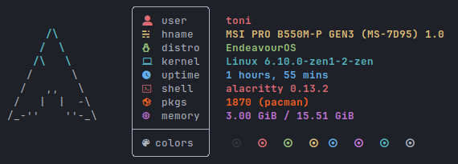
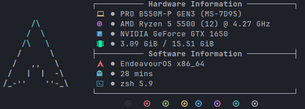
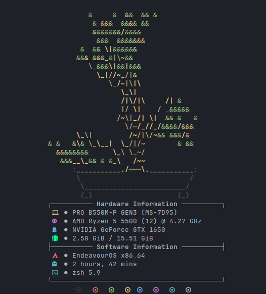
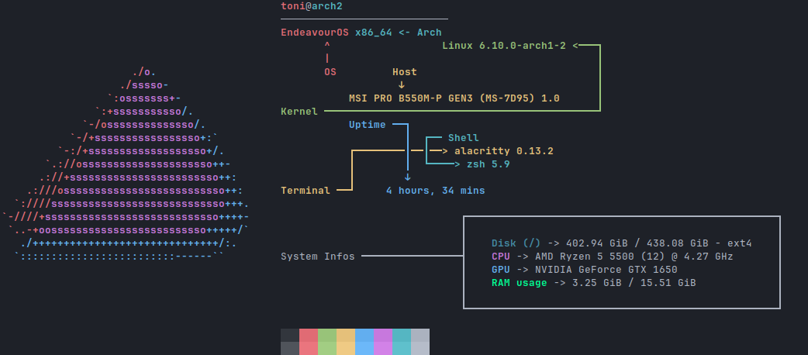
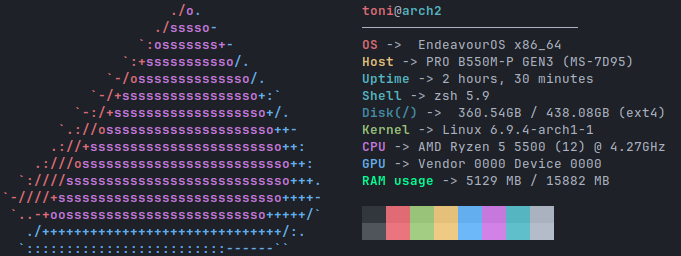

[](https://github.com/Toni500github/customfetch/blob/main/src)
[](https://github.com/Toni500github/customfetch/actions)\
[](https://forthebadge.com)

# Customfetch
>[!WARNING]
>customfetch is in alpha, it will be 100% ready with a stable release.\
>It is pretty stable right now though, so give it a try, why not\
>Don't forget to open any issue/PR for any problem.\
>Thanks!

A system information fetch tool (or [neofetch](https://github.com/dylanaraps/neofetch) like program), which its focus point is the customizability and perfomance.\
`customfetch` is designed to provide a really customizable way to display your system informations in the way you like or want.

Currently supports Linux distros only. Android may be coming when stable release
<!-- Comment this because it's still in WIP for 3 weeks, no shit it won't work on some OSs
>[!NOTE]
>The goal is to be cross-platform, so maybe Android and MacOS support will come some day\
>but if you're using a UNIX OS, such as FreeBSD or MINIX, or those "obscure" OSs\
>then some, if not most, query infos won't probably work.\
>So you may want to relay to shell commands for quering\
>or maybe continue using neofetch/fastfetch if it still works great for you
-->




<p align="center">
    
</p>


## Key Features

* **GUI mode (GTK3)**
* Really customizable and fast, check [Config (with explanation)](#config-with-explanation) section
* Lightweight
>[!NOTE]
>enabling GUI mode may slow down customfetch a bit because it needs to load the GUI libraries at runtime\
>To check if it's enabled or not, run "cufetch --version"

## Depends
currently requires **C++20**, but it's possible to compile with C++17 too (not officially supported)

* `libdl` (should come already installed in almost every distro)

If you want to install with GUI mode install from your package manager:
* `gtk3`
* `gtkmm3`

## Installation

### Debian/Ubuntu and based
Download the latest `.deb` package in [releases](https://github.com/Toni500github/customfetch/releases/latest)

### Arch and based (AUR)
```bash
# btw checkout our other project https://github.com/BurntRanch/TabAUR ;)
# either
taur -S customfetch-bin

# or wiht GUI mode
taur -S customfetch-gui-bin
```

### General Distros (Manual installation)
Download the latest `.tar.gz` tarball file in [releases](https://github.com/Toni500github/customfetch/releases/latest) \
It contains the binary `cufetch` and the manual `cufetch.1` with the `LICENSE`.\
Togheter with the directory `assets/ascii` with the distro ascii art logos.\
If installing the GUI mode version, there's `cufetch.desktop`

### Arch and based (AUR) (source)
```bash
# either
taur -S customfetch

# or wiht GUI mode
taur -S customfetch-gui
```

### Arch and based (unstable) (AUR) (source)
```bash
# either
taur -S customfetch-git

# or wiht GUI mode
taur -S customfetch-gui-git
```

### Compile from (source) (unstable)
```bash
# clone the git dir
git clone https://github.com/Toni500github/customfetch
cd customfetch

# DEBUG=0 for release build
# GUI_MODE=0 for disabling GUI mode, or =1 for enable it (will slow down a bit if run in terminal)
make install DEBUG=0 GUI_MODE=0

# automatically generates a config and prints the infos
cufetch
```

## Config (with explanation)

Here's an example using my config



The config:

```toml
[config]

# The array for displaying the system infos
layout = [
    "$<builtin.title>",
    "$<builtin.title_sep>",
    "${auto}OS: $<os.name> $<system.arch>",
    "${auto}Host: $<system.host>",
    "${auto}Kernel: $<os.kernel>",
    "${auto}Uptime: $<os.uptime>",
    "${auto}Terminal: $<user.term>",
    "${auto}Shell: $<user.shell>",
    "${auto}Packages: $<os.pkgs>",
    "${auto}Theme: $<theme-gtk-all.name>",
    "${auto}Icons: $<theme-gtk-all.icons>",
    "${auto}Font: $<theme-gtk-all.font>",
    "${auto}Cursor: $<theme.cursor> ($<theme.cursor_size>px)",
    "${auto}WM: $<user.wm_name>",
    "${auto}DE: $<user.de_name>",
    "${auto}Disk(/): $<disk(/).disk>",
    "${auto}CPU: $<cpu.cpu>",
    "${auto}GPU: $<gpu.name>",
    "${auto}RAM: $<ram.ram>",
    "",
    "$<builtin.colors_bg>", # normal colors palette
    "$<builtin.colors_light_bg>" # light colors palette
]

# display ascii-art or image/gif (GUI only) near layout
# put "os" for displaying the OS ascii-art
# or the "/path/to/file" for displaying custom files
# or "off" for disabling ascii-art or image displaying
source-path = "os"

# Path to where we'll take all the distros/OSs ascii arts
# note: it MUST contain an "ascii" subdirectory
data-dir = "/usr/share/customfetch"

# The type of ASCII art to apply ("small", "old").
# Basically will add "_<type>" to the logo filename.
# It will return the regular linux ascii art if it doesn't exist.
# Leave empty it for regular.
ascii-logo-type = ""

# A char (or string) to use in $<builtin.title_sep>
title-sep = "-"

# A separator (or string) that when ecountered, will automatically
# reset color, aka. automatically add ${0} (only in layout)
# Make it empty for disabling
sep-reset = ":"

# Should we reset color after or before the separator?
# true  = after  ("test ->${0} ")
# false = before ("test ${0}-> ")
sep-reset-after = false

# Offset between the ascii art and the layout
offset = 5

# Padding between the start and the ascii art
logo-padding-left = 0

# Padding of the ascii art from the top
logo-padding-top = 0

# Padding of the layout from the top
layout-padding-top = 0

# Colors can be with: hexcodes (#55ff88) and for bold put '!' (!#55ff88)
# OR ANSI escape code colors like "\e[1;34m"
# remember to add ${0} where you want to reset color
black   = "\e[1;30m"
red     = "\e[1;31m"
green   = "\e[1;32m"
yellow  = "\e[1;33m"
blue    = "\e[1;34m"
magenta = "\e[1;35m"
cyan    = "\e[1;36m"
white   = "\e[1;37m"

# $<os.uptime> config
[os.uptime]
# how to display the name of the uptime
# e.g: hours = "hrs" -> "Uptime: 3hrs"
days  = " days"
hours = " hours"
mins  = " mins"
secs  = " seconds"

# $<os.pkgs> config
[os.pkgs]
# Ordered list of which packages installed count should be displayed in $<os.pkgs>
# remember to not enter the same name twice, else the world will finish
# Choices: pacman, flatpak, dpkg, apk
#
# Pro-tip: if your package manager isnt listed here, yet,
# use the bash command tag in the layout
# e.g "Packages: $(pacman -Q | wc -l) (pacman)"
pkg-managers = ["pacman", "dpkg", "flatpak"]

# Distros and package manager specific
# package manager paths for getting the packages count from path.
# They are arrayies so you can add multiple paths.
#
# If you don't know what these ares, leave them by default settings
pacman-dirs  = ["/var/lib/pacman/local/"]
dpkg-files   = ["/var/lib/dpkg/status"]
flatpak-dirs = ["/var/lib/flatpak/app/", "~/.local/share/flatpak/app/"]
apk-files    = ["/var/lib/apk/db/installed"]

# GUI options
# note: customfetch needs to be compiled with GUI_MODE=1 (check with "cufetch --version")
[gui]
enable = false

# Font to be used
# syntax must be [FAMILY-LIST] [STYLE-OPTIONS] [SIZE]
# e.g "Liberation Mono Normal 12"
# check https://lazka.github.io/pgi-docs/Pango-1.0/classes/FontDescription.html#Pango.FontDescription for more infos
font = "Liberation Mono Normal 12"

# These are the colors palette you can use in the GUI mode.
# They can overwritte with ANSI escape code colors
# but they don't work with those, only hexcodes
black   = "!#000005"
red     = "!#ff2000"
green   = "!#00ff00"
blue    = "!#00aaff"
cyan    = "!#00ffff"
yellow  = "!#ffff00"
magenta = "!#f881ff"
white   = "!#ffffff"

# Path to image as a background.
# put "disable" for disabling and use the theme color as background.
bg-image = "/tmp/idk.png"

```

We use the `config.toml` file, in there we got an array variable called "layout". That's the variable where you customize how the infos should be displayed.\
You have 5 tags: 
* `$<module.member>` - Used for printing the value of a member of a module.
* `${color}` - Used for displaying text in a specific color.
* `$(bash command)` - Used to execute bash commands and print the output.
* `$[something,equalToSomethingElse,iftrue,ifalse]` - Conditional tag to display different outputs based on the comparison.
* `$%n1,n2%` - Used to print the percentage and print with colors

They can be used in the ascii art text file and layout, but how to use them?

* **The info tag (`$<>`)** will print a value of a member of a module\
 e.g `$<user.name>` will print the username, `$<os.kernel_version>` will print the kernel version and so on.\
 All the modules and their members are listed in the `--list-modules` argument

* **The bash command tag (`$()`)** let's you execute bash commands and print the output\
 e.g `$(echo \"hello world\")` will indeed echo out Hello world.\
 you can even use pipes\
 e.g `$(echo \"hello world\" | cut -d' ' -f2)` will only print world

* **The conditional tag (`$[]`)** is used for displaying different outputs based on the comparison.\
  Syntax MUST be `$[something,equalToSomethingElse,iftrue,ifalse]` with no spaces between commas.\
  Each part can have a tag or anything else.\
  e.g `$[$<user.name>,$(echo $USER),the name is correct,the name is NOT correct]`\
  This is useful when on some terminal or WM the detection can be different than others\

* **The color tag (`${}`)** is used for which color to use for colorizing the text\
 e.g `${red}hello world` will indeed print "hello world" in red (or the color you set in the variable).\
 The colors can be: <ins>black</ins>, <ins>red</ins>, <ins>green</ins>, <ins>blue</ins>, <ins>cyan</ins>, <ins>yellow</ins>, <ins>magenta</ins>, <ins>white</ins> and they can be configured in the config file.\
 You can put a custom hex color e.g: `${#ff6622}`.\
 It's possible to enable multiple options, put these symbols before `#`:\
 &nbsp;&nbsp;&nbsp;&nbsp;&nbsp;`b` - for making the color in the background\
 &nbsp;&nbsp;&nbsp;&nbsp;&nbsp;`u` - for underline the text\
 &nbsp;&nbsp;&nbsp;&nbsp;&nbsp;`!` - for making the text bold\
 &nbsp;&nbsp;&nbsp;&nbsp;&nbsp;`i` - for making the text italic\
 \
 Alternatively, ANSI escape codes can be used, e.g `\\e[1;31m` and `\\e[38;5;160m`\
 (NOTE: 256 colors ANSI escape codes, those that have `\e[38` or `\e[48`, can't be used in GUI mode).\
 For auto coloring, depending on the ascii logo colors, use `${auto}`.\
 They can be used for different colors too. So for getting the 2nd color of the ascii logo,\
 use `${auto2}`, for the 4th one use `${auto4}` and so on.
 If you're in GUI mode and the source path is an image, all the auto colors will be white

* **The Percentage tag (`$%%`)** is used for displaying the percentage between 2 numbers.\
  It **Must** contain a comma for separating the 2. They can be either be taken from a tag or it put yourself.\
  For example: $%10,5%
  For inverting colors of bad and great (red and green), before the last '%' a put '!' without quotes

Any `$` or brackets can be escaped with a backslash `\`

# TODOs
* Color all ASCII arts (101/262) will take long ahh time
* Support images on terminal as logo (currently only available in GUI mode)
* idk

# Thanks
I would like to thanks:
* my best-friend [BurntRanch](https://github.com/BurntRanch/),\
&nbsp;&nbsp;&nbsp;&nbsp;&nbsp;&nbsp;For helping me initialize this project and motivate me for keep going\
&nbsp;&nbsp;&nbsp;&nbsp;&nbsp;&nbsp;And also for making my customizability idea come true with the parsing.

* the Better C++ [discord server](https://discord.gg/uSzTjkXtAM), \
&nbsp;&nbsp;&nbsp;&nbsp;&nbsp;&nbsp;For helping me improving the codebase and helping me with any issues I got,\
&nbsp;&nbsp;&nbsp;&nbsp;&nbsp;&nbsp;And also for being patient with me XD

* [fastfetch](https://github.com/fastfetch-cli/fastfetch/) and [neofetch](https://github.com/dylanaraps/neofetch),\
&nbsp;&nbsp;&nbsp;&nbsp;&nbsp;&nbsp;For inspiring this project

* [{fmt}](https://github.com/fmtlib/fmt) and [toml++](https://github.com/marzer/tomlplusplus) libraries\
&nbsp;&nbsp;&nbsp;&nbsp;&nbsp;&nbsp;Our favorite libraries that me and BurntRanch uses

* this string switch-case [library](https://github.com/xroche/stringswitch), \
&nbsp;&nbsp;&nbsp;&nbsp;&nbsp;&nbsp;Really amazing, thanks for making this 

I hope you'll like customfetch, and also checkout [TabAUR](https://github.com/BurntRanch/TabAUR/tree/dev), our other project that was made before customfetch.\
Don't forgot [sdl_engine](https://github.com/BurntRanch/sdl_engine) too ;)


