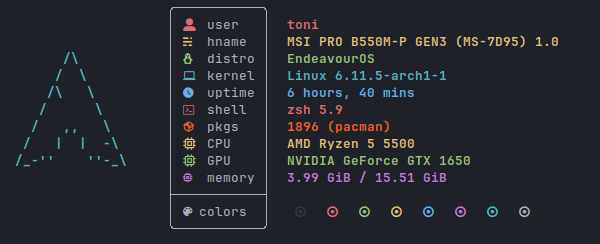

[](https://aur.archlinux.org/packages/customfetch-git/)
[](https://aur.archlinux.org/packages/customfetch-gui-git/)\
[](https://forthebadge.com)

# Customfetch
>[!WARNING]
>customfetch is still WIP and in alpha, it will be ready with a stable release.\
>If you still wanna try, go ahead and compile it. Don't forget to open an issue/PR for any problem.\
>Thanks!

A system information fetch tool (or [neofetch](https://github.com/dylanaraps/neofetch) like program), which its focus point is the customizability and perfomance.\
`customfetch` is designed to provide a really customizable way to display your system informations in the way you like or want.

Currently supports Linux distros only. Android may be coming when stable release
<!-- Comment this because it's still in WIP for 3 weeks, no shit it won't work on some OSs
>[!NOTE]
>The goal is to be cross-platform, so maybe Android and MacOS support will come some day\
>but if you're using a UNIX OS, such as FreeBSD or MINIX, or those "obscure" OSs\
>then some, if not most, query infos won't probably work.\
>So you may want to relay to shell commands for quering\
>or maybe continue using neofetch/fastfetch if it still works great for you 
-->




<p align="center">
    
</p>


## Key Features

* **GUI mode (GTK3)**
* Really customizable and fast, check [Config (with explanation)](#config-with-explanation) section
* Lightweight
>[!NOTE]
>enabling GUI mode may slow down customfetch a bit because it needs to load the GUI libraries at runtime\
>To check if it's enabled or not, run "cufetch --version"

## Depends
currently there aren't any dependencies to install, other than having `libdl` installed.\
If you want to install with GUI mode install: `gtk3` and `gtkmm3` from your package manager

## Installation

### Debian/Ubuntu and based
Download the latest `.deb` package in [releases](https://github.com/Toni500github/customfetch/releases/latest)

### Arch and based (unstable) (AUR)
```bash
# btw checkout our other project https://github.com/BurntRanch/TabAUR ;)
taur -S customfetch-git

# wiht GUI mode
taur -S customfetch-gui-git
```

### General Distros (Manual installation)
Download the latest `.tar.gz` tarball file in [releases](https://github.com/Toni500github/customfetch/releases/latest) \
It contains the binary `cufetch` and the manual `cufetch.1` with the LICENSE.\
Togheter with the directory `assets/ascii` with the distro ascii art logos

### Compile from source (unstable)
```bash
# clone the git dir
git clone https://github.com/Toni500github/customfetch
cd customfetch

# DEBUG=0 for release build
# GUI_MODE=0 for disabling GUI mode, or =1 for enable it (will slow down a bit if run in terminal)
make install DEBUG=0 GUI_MODE=0

# automatically generates a config and prints the infos
cufetch
```

## Config (with explanation)

Here's an example using my config


The config:

```toml
[config]

# The array for displaying the system infos
layout = [
    "${auto2}$<user.name>${0}@${auto2}$<os.hostname>",
    "───────────────────────────",
    "${auto}OS: $<os.name> $<system.arch>",
    "${auto}Host: $<system.host>",
    "${auto}Kernel: $<os.kernel>",
    "${auto}Uptime: $<os.uptime>",
    "${auto}Terminal: $<user.term>",
    "${auto}Shell: $<user.shell>",
    "${auto}Packages: $<os.pkgs>",
    "${auto}Theme: $<theme-gtk-all.name>",
    "${auto}Icons: $<theme-gtk-all.icons>",
    "${auto}Font: $<theme-gtk-all.font>",
    "${auto}Cursor: $<theme.cursor> ($<theme.cursor_size>px)",
    "${auto}WM: $<user.wm_name>",
    "${auto}DE: $<user.de_name>",
    "${auto}Disk(/): $<disk(/).disk>",
    "${auto}CPU: $<cpu.cpu>",
    "${auto}GPU: $<gpu.name>",
    "${auto}RAM: $<ram.ram>",
    "",
    "${\e[40m}   ${\e[41m}   ${\e[42m}   ${\e[43m}   ${\e[44m}   ${\e[45m}   ${\e[46m}   ${\e[47m}   ", # normal colors
    "${\e[100m}   ${\e[101m}   ${\e[102m}   ${\e[103m}   ${\e[104m}   ${\e[105m}   ${\e[106m}   ${\e[107m}   " # light colors
]

# display ascii-art or image/gif (GUI only) near layout
# put "os" for displaying the OS ascii-art
# or the "/path/to/file" for displaying custom files
# or "off" for disabling ascii-art or image displaying
source-path = "os"

# Path to where we'll take all the distros/OSs ascii arts
# note: it MUST contain an "ascii" subdirectory
data-dir = "~/customfetch/assets"

# A separetor (string) that when ecountered, will automatically
# reset color, aka. automatically add ${0} (only in layout)
# Make it empty for disabling
sep-reset = ":"

# Offset between the ascii art and the system infos
offset = 5

# Padding of the logo from the top
logo-padding-top = 0

# Colors can be with: hexcodes (#55ff88) and for bold put '!' (!#55ff88)
# OR ANSI escape code colors like "\e[1;34m"
# remember to add ${0} where you want to reset color
black = "\e[1;30m"
red = "\e[1;31m"
green = "\e[1;32m"
yellow = "\e[1;33m"
blue = "\e[1;34m"
magenta = "\e[1;35m"
cyan = "\e[1;36m"
white = "\e[1;37m"

# $<os.uptime>  config
[os.uptime]
# how to display the name of the uptime
# e.g: hours = "h" -> "Uptime: 3h"
days = " days"
hours = " hours"
mins = " mins"
secs = " seconds"

# $<os.pkgs> config
[os.pkgs]
# Ordered list of which packages installed count should be displayed in $<os.pkgs>
# remember to not enter the same name twice, else the world will finish
# Choices: pacman, flatpak, dpkg
#
# Pro-tip: if your package manager isnt listed here, yet,
# use the bash command component in the layout
# e.g "Packages: $(pacman -Q | wc -l) (pacman)"
pkg-managers = ["pacman", "dpkg", "flatpak"]

# GUI options
# note: customfetch needs to be compiled with GUI_MODE=1 (check with "cufetch --version")
[gui]
enable = false

# Font to be used
# syntax must be [FAMILY-LIST] [STYLE-OPTIONS] [SIZE]
# e.g "Liberation Mono Normal 12"
# check https://lazka.github.io/pgi-docs/Pango-1.0/classes/FontDescription.html#Pango.FontDescription for more infos
font = "Liberation Mono Normal 12"

# These are the colors palette you can use in the GUI mode.
# They can overwritte with ANSI escape code colors
# but they don't work with those, only hexcodes
black = "!#000005"
red = "!#ff2000"
green = "!#00ff00"
blue = "!#00aaff"
cyan = "!#00ffff"
yellow = "!#ffff00"
magenta = "!#f881ff"
white = "!#ffffff"

# Path to image as a background.
# put "disable" for disabling and use the theme color as background.
bg-image = "/tmp/idk.png"

```

We got the config.toml file, in there we got an array variable called "layout". That's the variable where you customize how the infos should be displayed.\
You have 3 components: `$<module.submod>`, `${color}`, `$(bash command)`. They can be used in the ascii art text file and layout, but how to use them?

* **The info component (`$<>`)** will print a member of a module\
 e.g `$<user.name>` will print the username, `$<os.kernel_version>` will print the kernel version and so on.\
 run "cufetch -l" for a list of builti-in modules

* **The bash command component (`$()`)** let's you execute bash commands\
 e.g `$(echo \"hello world\")` will indeed echo out Hello world.\
 you can even use pipes\
 e.g `$(echo \"hello world\" | cut -d' ' -f2)` will only print world

* **The color component (`${}`)** is used for which color to use for colorizing the text\
 e.g "${red}hello world" will indeed print "hello world" in red (or the color you set in the variable)\
 you can even put a custom hex color e.g: `${#ff6622}` (for bold text put ! before # e.g `${!#ff6622}`)\
 OR ANSI escape code colors e.g `${\e[1;32m}` or `"\e[38;5;160m` (NOTE: 256 colors ANSI escape codes, those that have \e[38 or \e[48, can't be used in GUI mode).\
 For auto coloring, depending on the ascii logo colors, use `${auto}`.\
 They can be used for different colors too. So for getting the 2nd color of the ascii logo,\
 use `${auto2}`, for the 4th one use `${auto4}` and so on.

Any $ or brackets can be escaped with \\

# Thanks
I wanna thanks so much:
* my best-friend [BurntRanch](https://github.com/BurntRanch/),\
&nbsp;&nbsp;&nbsp;&nbsp;&nbsp;&nbsp;For helping me initialize this project and motivate me for keep going\
&nbsp;&nbsp;&nbsp;&nbsp;&nbsp;&nbsp;And also for making my customizability idea come true with the parsing.

* the Better C++ [discord server](https://discord.gg/uSzTjkXtAM), \
&nbsp;&nbsp;&nbsp;&nbsp;&nbsp;&nbsp;For helping improving the codebase and helping me with any issues I got,\
&nbsp;&nbsp;&nbsp;&nbsp;&nbsp;&nbsp;And also for being patient with me XD

* [fastfetch](https://github.com/fastfetch-cli/fastfetch/) and [neofetch](https://github.com/dylanaraps/neofetch),\
&nbsp;&nbsp;&nbsp;&nbsp;&nbsp;&nbsp;For inspiring this project

I hope you'll like customfetch, and also checkout [TabAUR](https://github.com/BurntRanch/TabAUR/tree/dev), our other project that was made before customfetch.\
Don't forgot [sdl_engine](https://github.com/BurntRanch/sdl_engine) too ;)


