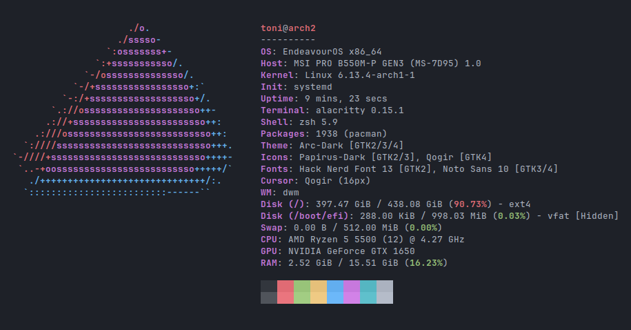

<p align="center">
  
</p>
<h2></h2> <!-- add a separating line -->
<p align="center">
    A modular information fetching (neofetch-like) tool, which its focus point is the performance and <b>customizability</b>
</p>

<p align="center">
    
    
    
</p>

<!--Currently supports Linux distros only. Android may be coming when stable release
<!-- Comment this because it's still in WIP for 3 weeks, no shit it won't work on some OSs
>[!NOTE]
>The goal is to be cross-platform, so maybe Android and MacOS support will come some day\
>but if you're using a UNIX OS, such as FreeBSD or MINIX, or those "obscure" OSs\
>then some, if not most, query infos won't probably work.\
>So you may want to relay to shell commands for quering\
>or maybe continue using neofetch/fastfetch if it still works great for you
-->

<!-- Looks fire on PC but ass on mobile fucking hell. too bad -->


<p align="center">
    
</p>


## Key Features
* Run customfetch as a **terminal** or **GTK3 application** or even as an [android widget](https://github.com/Toni500github/customfetch-android-app)
* Really easy to [customize](#How-to-customize)
* Flexible [plugin](#Plugins) system
* Incredibly extensible information fetchings
* Super lightweight, 3.3MB max (GTK3 application)

# Dependencies
Customfetch requires **no mandatory** dependencies.\
For building from source, only requires **C++20** but it's possible to compile with C++17 too (may not be always supported)

Here I'll list some packages to install for the GTK3 app or for making customfetch faster.
The names of the packages can vary depending on the package manager or distro.

If you want to install the GUI app install from your package manager:
* `gtk3`
* `gtkmm3`

optional dependencies that will make customfetch faster.
* `dconf`: Alternative to the slow `gsettings` command
* `libxfce4util`: Query XFCE4 version faster
* `wayland-client`: Library for getting the Wayland compositor faster

# Installation

## Debian/Ubuntu and based
Download the latest `.deb` package in [releases](https://github.com/Toni500github/customfetch/releases/latest)

## Android widget
Moved to the new repo: https://github.com/Toni500github/customfetch-android-app

## Arch and based (AUR)
```bash
# Terminal only
yay -S customfetch-bin

# GUI app only
yay -S customfetch-gui-bin
```

## General Distros (Manual installation)
Download the latest `.tar.gz` tarball file in [releases](https://github.com/Toni500github/customfetch/releases/latest) \
It contains the `/usr` directory where you'll install it in your distro. Useful for package managers too.

## Arch and based (AUR) (source)
```bash
# Terminal only
yay -S customfetch

# GUI app only
yay -S customfetch-gui
```

## Arch and based (unstable) (AUR) (source)
```bash
# Terminal only
yay -S customfetch-git

# GUI app only
yay -S customfetch-gui-git
```

## Compile from (source) (unstable)
```bash
# clone the git dir
git clone --depth=1 https://github.com/Toni500github/customfetch
cd customfetch

# DEBUG=0 for release build
# GUI_APP=0 or =1 for compiling either the terminal version or the GUI app
make install DEBUG=0 GUI_APP=0

# automatically generates a config and prints the infos
customfetch
```

## How to customize

Read the manual `customfetch.1` or execute customfetch with the arg `-w` for knowing more about the configuration in customfetch.\
This is only an explaination about tags and preview, that can be always found in the documentation.

Here's an example using my config



```toml
[config]

# The array for displaying the system infos
layout = [
    "$<title>",
    "$<title.sep>",
    "${auto}OS: $<os.name> $<system.arch>",
    "${auto}Host: $<system.host>",
    "${auto}Kernel: $<os.kernel>",
    "${auto}Uptime: $<os.uptime>",
    "${auto}Terminal: $<user.terminal>",
    "${auto}Shell: $<user.shell>",
    "${auto}Packages: $<os.pkgs>",
    "${auto}Theme: $<theme.gtk.all.name>",
    "${auto}Icons: $<theme.gtk.all.icons>",
    "${auto}Font: $<theme.gtk.all.font>",
    "${auto}Cursor: $<theme.cursor>",
    "${auto}WM: $<user.wm.name> $<user.wm.version>",
    "${auto}DE: $<user.de.name> $<user.de.version>",
    "$<auto.disk>",
    "${auto}Swap: $<swap>",
    "${auto}CPU: $<cpu>",
    "${auto}GPU: $<gpu>",
    "${auto}RAM: $<ram>",
    "",
    "$<colors>", # normal colors palette
    "$<colors.light>" # light colors palette
]


```

In the config we got an array variable called "layout". That's the variable where you customize how the infos should be displayed.\
There are 5 tags:
* `$<info.module>` - Used for printing the value of a module or its submembers.
* `${color}` - Used for displaying text in a specific color after it.
* `$(bash command)` - Used to execute bash commands and print the output.
* `$[something,equalToSomethingElse,iftrue,ifalse]` - Conditional tag to display different outputs based on the comparison.
* `$%n1,n2%` - Used to print the percentage and print with colors

They can be used in the ascii art text file and layout, but how to use them?

* **The info tag (`$<>`)** will print a value of a member of a module.\
 e.g `$<user.name>` will print the username, `$<os.kernel.version>` will print the kernel version and so on.\
 All the modules and their members are listed in the `--list-modules` argument

* **The bash command tag (`$()`)** let's you execute bash commands and print the output\
 e.g `$(echo \"hello world\")` will indeed echo out Hello world.\
 you can even use pipes\
 e.g `$(echo \"hello world\" | cut -d' ' -f2)` will only print world

* **The conditional tag (`$[]`)** is used for displaying different outputs based on the comparison.\
  Syntax MUST be `$[something,equalToSomethingElse,iftrue,ifalse]` (**note**: putting spaces between commas can change the expected result).\
  Each part can have a tag or anything else.\
  e.g `$[$<user.name>,$(echo $USER),the name is correct,the name is NOT correct]`\
  This is useful when on some terminal or WM the detection can be different than others,\
  Or maybe even on holidays for printing special texts\

* **The color tag (`${}`)** is used for printing the text in a certain color.\
 e.g `${red}hello world` will indeed print "hello world" in red (or the color you set in the variable/tag).\
 The colors can be: <ins>black</ins>, <ins>red</ins>, <ins>green</ins>, <ins>blue</ins>, <ins>cyan</ins>, <ins>yellow</ins>, <ins>magenta</ins>, <ins>white</ins> and they can be configured in the config file.\
 **ANSI escape colors** can be used, e.g `\e[1;31m` or `\e[38;2;160;223;11m`.\
 Alternatively, You can put a custom **hex color** e.g: `#ff6622`.\
 You can also use them inside the tag, like `${!#343345}` or `${\e[1;31m}`.\
 It's possible to enable multiple options, put these symbols before `#`:\
 &nbsp;&nbsp;&nbsp;&nbsp;&nbsp;&nbsp;&nbsp;&nbsp;&nbsp;&nbsp;&nbsp;&nbsp;&nbsp;&nbsp;&nbsp;&nbsp;**Terminal and GUI**\
 &nbsp;&nbsp;&nbsp;&nbsp;&nbsp;`b` - for making the color in the background\
 &nbsp;&nbsp;&nbsp;&nbsp;&nbsp;`u` - to  underline the text\
 &nbsp;&nbsp;&nbsp;&nbsp;&nbsp;`!` - for making the text bold\
 &nbsp;&nbsp;&nbsp;&nbsp;&nbsp;`i` - for making the text italic\
 &nbsp;&nbsp;&nbsp;&nbsp;&nbsp;`s` - for strikethrough text\
 &nbsp;&nbsp;&nbsp;&nbsp;&nbsp;&nbsp;&nbsp;&nbsp;&nbsp;&nbsp;&nbsp;&nbsp;&nbsp;&nbsp;&nbsp;&nbsp;**GUI Only**\
 &nbsp;&nbsp;&nbsp;&nbsp;&nbsp;`o` - for overline\
 &nbsp;&nbsp;&nbsp;&nbsp;&nbsp;`a(value)` - for fg alpha (either a percentage value like `50%` or a plain integer between 1 and 65536)\
 &nbsp;&nbsp;&nbsp;&nbsp;&nbsp;`L(value)` - for choosing an underline style (`none`, `single`, `double`, `low`, `error`)\
 &nbsp;&nbsp;&nbsp;&nbsp;&nbsp;`U(value)` - for choosing the underline color (hexcode color)\
 &nbsp;&nbsp;&nbsp;&nbsp;&nbsp;`B(value)` - for choosing the bg color text (hexcode color)\
 &nbsp;&nbsp;&nbsp;&nbsp;&nbsp;`S(value)` - for choosing the strikethrough color (hexcode color)\
 &nbsp;&nbsp;&nbsp;&nbsp;&nbsp;`O(value)` - for choosing the overline color (hexcode color)\
 &nbsp;&nbsp;&nbsp;&nbsp;&nbsp;`A(value)` - for choosing the bg text alpha (either a percentage value like `50%` or a plain integer between 1 and 65536)\
 &nbsp;&nbsp;&nbsp;&nbsp;&nbsp;`w(value)` - for choosing the font weight (`ultralight`, `light`, `normal`, `bold`, `ultrabold`, `heavy`, or a numeric weight)\
 &nbsp;&nbsp;&nbsp;&nbsp;&nbsp;&nbsp;&nbsp;&nbsp;&nbsp;&nbsp;&nbsp;&nbsp;&nbsp;&nbsp;&nbsp;&nbsp;**Terminal Only**\
 &nbsp;&nbsp;&nbsp;&nbsp;&nbsp;`l` - for blinking text\
 \
 To reset colors, use `${0}` for a normal reset or `${1}` for a bold reset.\
 For auto coloring, depending on the ascii logo colors, use `${auto}`.\
 They can be used for different colors too. So for getting the 2nd color of the ascii logo,\
 use `${auto2}`, for the 4th one use `${auto4}` and so on.\
 If you're using the GUI app and the source path is an image, all the auto colors will be the same colors as the distro ascii art.

* **The Percentage tag (`$%%`)** is used for displaying the percentage between 2 numbers.\
  It **must** contain a comma for separating the 2. They can be either be taken from a tag or it put yourself.\
  For example: $%10,5%
  For inverting colors of bad and great (red and green), before the first `%` a put `!`

Any `$` or brackets can be escaped with a backslash `\`. You need to escape backslashes too :(\
**NOTE:** For having compatibility with the GUI app, you need to escape `<` (EXCEPT if you are using in a info tag, like `$<os.name>`) and `&`\
e.g `the number 50 is \\< 100 \\&\\& 98`
Won't affect the printing in terminal.

## Plugins
Thanks to plugins, `customfetch` is able to query way more information than just system information, unlike regular neofetch-like programs.

You can easily install community-made plugins by using `cufetchpm`, example: `cufetchpm install https://github.com/Toni500github/customfetch-plugins-github`.
This example installs a repository, which can have multiple plugins. read `cufetchpm --help` for more information.

## Writing your own plugins
Plugins are mostly just shared libraries, so you could easily write your own plugin! there's an [example](https://github.com/Toni500github/customfetch/blob/main/examples/mod-library.cc) with detailed comments that explain everything!

## Star History

<a href="https://www.star-history.com/#Toni500github/customfetch&Date">
 <picture>
   <source media="(prefers-color-scheme: dark)" srcset="https://api.star-history.com/svg?repos=Toni500github/customfetch&type=Date&theme=dark" />
   <source media="(prefers-color-scheme: light)" srcset="https://api.star-history.com/svg?repos=Toni500github/customfetch&type=Date" />
   
 </picture>
</a>

# TODOs
* release v2.0.0
* work on the android app (later)

# Thanks
I would like to thanks:
* my best-friend [BurntRanch](https://github.com/BurntRanch/),\
&nbsp;&nbsp;&nbsp;&nbsp;&nbsp;&nbsp;For helping me initialize this project and motivate me to keep going\
&nbsp;&nbsp;&nbsp;&nbsp;&nbsp;&nbsp;And also for making my customizability idea come true with the first prototype of the parser.

* [saberr26](https://github.com/saberr26), \
&nbsp;&nbsp;&nbsp;&nbsp;&nbsp;&nbsp;For making the project logos

* the Better C++ [discord server](https://discord.gg/uSzTjkXtAM), \
&nbsp;&nbsp;&nbsp;&nbsp;&nbsp;&nbsp;For helping me improving the codebase and helping me with any issues I got,\
&nbsp;&nbsp;&nbsp;&nbsp;&nbsp;&nbsp;And also for being patient with me XD

* [fastfetch](https://github.com/fastfetch-cli/fastfetch/) and [neofetch](https://github.com/dylanaraps/neofetch),\
&nbsp;&nbsp;&nbsp;&nbsp;&nbsp;&nbsp;For inspiring this project

* [{fmt}](https://github.com/fmtlib/fmt) and [toml++](https://github.com/marzer/tomlplusplus) libraries\
&nbsp;&nbsp;&nbsp;&nbsp;&nbsp;&nbsp;Our favorite libraries that me and BurntRanch uses

* this string switch-case [library](https://github.com/xroche/stringswitch), \
&nbsp;&nbsp;&nbsp;&nbsp;&nbsp;&nbsp;Really amazing, thanks for making this

I hope you'll like customfetch, and also checkout [TabAUR](https://github.com/BurntRanch/TabAUR/tree/dev), our other project that was made before customfetch.\
Don't forgot [sdl_engine](https://github.com/BurntRanch/sdl_engine) too ;)


